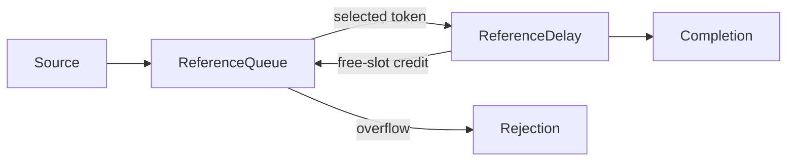
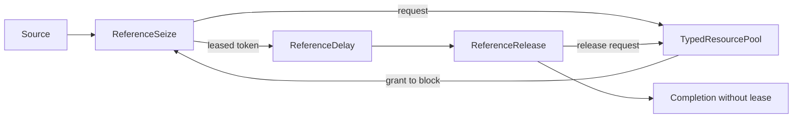

# Typed reference process blocks

Native C++ models can now compose separate queue, delay, seize, and release atomics using `EntityToken<Tag>` messages. Tokens carry an [entity-store reference](DES_ENTITY_STORE.md), priority snapshot, and any resource leases. Blocks preserve entity fields in the store and own their calendars, queues, leases in transit, and statistics by value for checked-step rollback.

## Queue and delay

`ReferenceQueue<Tag>` supports finite/unbounded waiting capacity and FIFO/LIFO/priority dispatch. Pull requests reserve output capacity and persist until fulfilled. A zero-capacity queue supports direct transfer when demand is available; overflow publishes an explicit rejection. The queue accounts for waiting time and exact queue area.

`ReferenceDelay<Tag>` caches a positive constant or provider-computed duration at admission and schedules an absolute deadline. Its default is unlimited parallel work. With finite capacity it publishes free-slot credits to a connected queue, including its initial capacity at time zero. Completions return credits; direct excess arrivals can instead follow its rejection port. A credit-controlled delay must receive all its tokens from the linked queue.



The separate blocks match all **96 pinned SimPy/Ciw queue traces**, including 1,382 service records and 922 rejections across FIFO/LIFO/priority, one/two slots, finite/unbounded waiting rooms, and four schedules. Individual waiting and service histories independently reconstruct queue/delay areas. Hand tests add unlimited delays, initial credits, zero waiting capacity, same-time completion/refill, residual demand, invalid variants/ports/namespaces, cached provider evaluation, fractional deadlines, statistics overflow, and checked downstream failure/retry.

## Shared resources

`ReferenceSeize<Tag>` requests a positive number of units and holds the token until the matching grant arrives. Request IDs combine a 16-bit block ID and the entity's 48-bit ID. `TypedResourcePool<Message>` routes each grant to the owning seize block through output port `block_id + 1`; multiple seize blocks can safely share a pool. The underlying pool provides the [validated FIFO/LIFO/priority arbitration](DES_DISCIPLINES.md).

A granted token carries a lease through later process blocks. `ReferenceRelease<Tag>` removes the configured pool's lease and publishes both its release request and the forwarded token in one checked DEVS step. It preserves unrelated leases. Unknown or mismatched grants, duplicate entities, malformed leases, missing ownership, and preemption requests fail explicitly. Model owners must assign unique seize-block IDs per pool and connect each seize/release to its configured pool namespace.



The resource adapter integrates allocated units, total capacity, and waiting count. Utilization is allocated-unit area divided by capacity area, including safe resizing and zero-capacity intervals. Projection queries are read-only. Hand tests cover two seize blocks sharing a priority pool, multilease preservation, request/unit mismatches, malformed same-bag grants, resizing, statistics overflow, and a downstream failure during release publication. Retry preserves ownership and does not double-count areas.

The seize→delay→release composition matches all **24 unbounded-waiting cases** from the same pinned trace corpus: 576 service histories across FIFO/LIFO/priority and one/two resource units. Every service requires a held lease, every completion releases it, and resource waiting/holding areas agree with individual histories. This comparison uses single-unit requests; the separate 96 integer-time resource traces cover varying unit counts and head blocking. The subset is selected explicitly by the test command, and missing cases cannot silently narrow it.

## Sources, sinks, selection, and runtime fields

`ReferenceSource` publishes prepared entity references in absolute schedule order. `ReferenceSink` accepts unleased completions and records cycle times from a pure origin provider. `ReferenceSelect` routes to the first satisfied condition or one addressed categorical draw. It caches choices and preserves all token metadata. Tests cover 8,192 Philox words plus exact integer category boundaries, zero-mass exits, short-circuiting, independent clones, invalid clocks/origins, and atomic callback/overflow failures.

`RuntimeEntityStore` adds named real/integer/boolean/string columns for schemas known at load time. Values must match exact field types; there is no implicit numeric or boolean coercion. Normal and sanitizer tests cover column growth, independent copies, tombstones, schema validation, identity exhaustion, and batch rollback. Units remain the declarative layer's responsibility.

```sh
ctest --test-dir build --output-on-failure -R 'des_entity_store|des_runtime_store|des_reference_'
```

These are C++ library components with explicit [semantics](SEMANTICS.md#reference-queue-and-delay-blocks). They are also available through [declarative typed process graphs](DES_TYPED_IR.md), with loader-checked schemas, units, and ownership paths. Resource deadlock avoidance, repeated visits, cancellation, preemption, and mutable external callbacks are outside this contract. Current verification status is recorded in [STATUS.md](STATUS.md).
