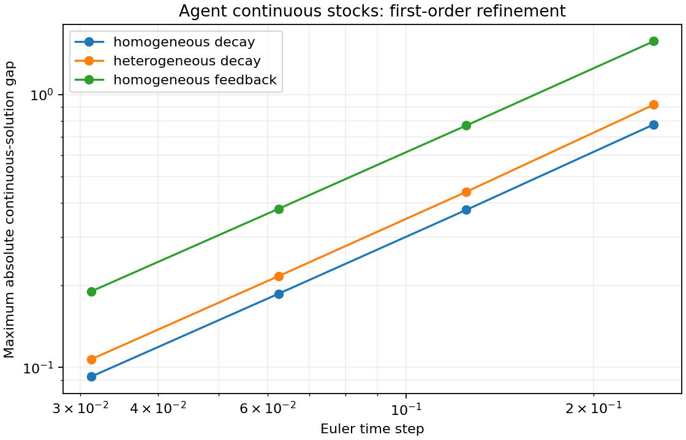

# Per-agent continuous stocks

The native `hybrid::AgentStocks<Tag>` bridge integrates selected real fields in a
typed population together with global SD stocks. The declared Euler correctness
gate passes locally. [DEVS snapshot wiring](HYBRID_AGENT_STOCKS_ATOMIC.md) is now
available in a subsequent increment; declarative wiring remains open.

The population records own the per-agent values. During a step, a temporary native
SD model integrates the selected fields and global stocks together; successful
results are committed back to the records. This reuses the existing stock/flow
solver without maintaining a second persistent copy of each agent's continuous
state. Unbound fields, tombstones, stable IDs and population topology are preserved.

Every rate reads the same committed snapshot at the start of the interval. A flow
can connect two fields on one agent, an agent field and a global stock, or a stock
and the external boundary. Global flows can read population sums. There is one
transfer rate at both endpoints, so internal transfers conserve material within
floating-point tolerance. Summation and evaluation use stable ID order.

For example, consultants can transfer remaining work into global completed work,
while a separate global flow integrates total remaining work over time. The latter
is an exposure measure, not an additional material inventory. If the committed
agent sum is six at time zero, a quarter-time step adds 1.5 to exposure regardless
of the lower agent sum published at the end of that step. Applying the newly
published sum retroactively is an ordering error caught by the oracle.

See [semantics](SEMANTICS.md#typed-agent-continuous-stocks-native-euler-contract)
and the runnable [example](../examples/agent_stocks.cpp).

## Validation

The frozen [plan](../tests/oracles/hybrid/agent-stock-plan.json) has three cases,
four step sizes (1/4, 1/8, 1/16, 1/32) and nine observation times from zero to four.
The independent Python oracle uses explicit discrete and continuous closed forms;
it does not call the native SD integrator or fit expectations to native outputs.

| Case | Population and flows | Validation |
|---|---|---|
| Homogeneous decay | Eight agents, initial work 2 each, completion rate .5 times work | Individual Euler recurrence, aggregate flow and continuous decay |
| Heterogeneous decay | Four agents, initial work 2/4/6/8, rates .25/.5/.75/1 | Distinct individual trajectories, conservative completion and aggregate exposure |
| Homogeneous feedback | Eight agents, initial work 2 each; reservoir 32 supplies at rate .5, divided equally; agent completion rate .25 | Simultaneous global-to-agent feedback, completion, conservation and exposure |

For pure decay, `x_n = x_0*(1-k*dt)^n`; the continuous solution replaces the power
with `exp(-k*t)`. For a reservoir with supply rate a, completion rate k and N agents,
`r_n = r_0*(1-a*dt)^n`, and each agent has the additional term
`a*r_0/[N*(k-a)] * [(1-a*dt)^n - (1-k*dt)^n]`. The declared feedback case has
distinct a and k. Geometric-series sums independently give the left-endpoint
exposure integral. Exponential integrals give its continuous counterpart.

All **108 snapshots, 720 individual values and three refinement curves pass**.
Maximum absolute recurrence discrepancy is **4.27e-14**; maximum material
conservation discrepancy is **1.43e-14**. The recurrence and conservation gate is
1e-11 times the relevant scale. First-order convergence is separately required to
lie between .85 and 1.15 on every consecutive step halving.

| Case | Maximum continuous gap at dt=1/4 | At dt=1/32 | Observed orders |
|---|---:|---:|---|
| Homogeneous decay | .776657 | .092573 | 1.040, 1.019, 1.010 |
| Heterogeneous decay | .917657 | .107175 | 1.061, 1.025, 1.012 |
| Homogeneous feedback | 1.567370 | .189977 | 1.026, 1.012, 1.006 |

The continuous-gap diagnostic is the largest absolute component error over
observations in this fixed, nondimensional reference system, including exposure.
It measures integration error, with no sampling error or stochastic population
limit. Individual values and all global outputs must also match the discrete law.



[Numeric gaps](figures/hybrid/agent-stocks-numeric.csv),
[SVG](figures/hybrid/agent-stocks-convergence.svg), and
[provenance](figures/hybrid/agent-stocks-provenance.json) are stored with this report.
Eight scorer negative controls reject missing/duplicate observations, corrupted
stocks and exposure, NaN, conserved but frozen kinetics, and retroactive aggregate
publication.

Native hand tests additionally compare homogeneous populations of 1, 3 and 16
agents with an equivalent three-stock pure-SD system over 64 steps at each of
three dt values: **576 coupled snapshots**. They cover heterogeneous transfers
between agent fields, global feedback, snapshot ordering across agents and fields,
signed stocks/rates, empty populations, preserved nonstock fields and network,
high stable IDs and retired rows, independent copying/replay, invalid bindings,
domain/overflow rejection, recursive mutation and whole-step rollback/retry.

All **eight focused CTests pass in normal and ASan/UBSan builds**: four new tests
and four existing SD/typed-population/clock/publication regressions. Native
trajectories and reports are byte-identical across builds; the example matches
across builds as well. The configured suite is 189 tests. The last full regression
remains 170/170 in both builds; remote CI has not run.

## Reproduce

```sh
cmake -S . -B build
cmake --build build --target hybrid_agent_stocks_tests hybrid_agent_stocks_oracle_tests fathom_agent_stocks
ctest --test-dir build -R '^hybrid_agent_stocks' --output-on-failure
./build/fathom_agent_stocks
MPLCONFIGDIR=/tmp/ankurafathom-mpl .venv-abm-oracle/bin/python tests/oracles/hybrid/agent_stocks_oracle.py --report build/hybrid-agent-stocks-report.json --plots docs/figures/hybrid
```

## Scope

This bridge currently has fixed membership and synchronous Euler steps. Rates are
pure C++ callbacks; independent model copies require value-owned callback captures.
Nonnegative stocks reject an overdraw instead of clipping it. A failed step leaves
the entire population, global stocks and clock intact; callback side effects are
outside that guarantee. Configuration freezes after the first successful step.

Typed aggregate reducers, C++ expression endpoints and an autonomous bridge atomic
are now available. The declarative contract, DEVS pulse/event phases, lifecycle changes and higher-order
coupled integration remain further work. There are no new IR fields in this
increment. [M5 acceptance](M5_ACCEPTANCE.md) remains open.
