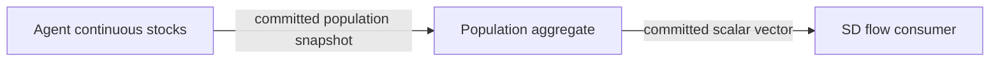

# Agent-stock DEVS publication

`AgentStocksAtomic<Tag>` connects the native per-agent continuous-stock core to
the typed aggregate and scalar-driven SD endpoints. It owns the core and publishes
the initial committed population at time zero. Each later tick integrates the core
first, then publishes a value-owned snapshot in a separate zero-time step.

The resulting native graph is:



At a shared tick, the consumer integrates its ending interval with the preceding
aggregate. The new agent values become inputs for the following interval. This
holds for all six component declaration orders. Different clocks use held values
between committed population ticks; the adapter does not interpolate agent fields.

Snapshots use tick indexes as revisions. The integer-indexed absolute clock avoids
accumulated decimal-step drift. An already-advanced core, nonfinite/nonpositive dt,
or an external input is rejected. Integration, revision and next deadline stage as
one transition. A later downstream publication failure restores pending messages
and retries without integrating the core again. Observations drain the same-time
microsteps to return a settled graph.

See [semantics](SEMANTICS.md#agent-stock-devs-snapshot-publisher) and the runnable
[coupled example](../examples/agent_stocks_coupled.cpp).

## Evidence

The frozen [plan](../tests/oracles/hybrid/agent-stocks-atomic-plan.json) combines
three previously validated stock models (homogeneous decay, heterogeneous decay,
and reservoir feedback), two population steps, four consumer/population step ratios
(.5, 1, 1.5, 2), all six declaration orders and 21 observation horizons.

The independent [Python oracle](../tests/oracles/hybrid/agent_stocks_atomic_oracle.py)
uses exact rational Euler stock transfers and rectangle integrals over the union
of both clocks. At a shared timestamp it integrates the consumer with the old
signal, commits the population step, then replaces the held signal. Intermediate
observation horizons do not force either clock to advance.

- **144 configurations, 3,024 snapshots and 35,280 scalar comparisons pass.**
- Population and consumer timestamps and revisions agree exactly.
- Maximum absolute discrepancy from the rational reference is **1.43e-14**.
- Eleven negative controls reject missing/duplicate observations, wrong clocks or
  revisions, corrupted agent/global stocks, bad scalar inputs, NaN and retroactive
  publication.
- Hand tests add **408 analytic snapshots** over six declaration orders and four
  clock ratios, conservation, equal aggregate exposure in coupled and equivalent
  native SD, observation-density invariance, empty populations, decimal clocks,
  independent snapshots/clones, stock-domain and next-deadline rollback, budget
  retry and downstream failure/retry.

All **nine focused tests pass in normal and ASan/UBSan session builds**: five new
checks plus agent-stock, typed-aggregate, clock and SD regressions. Trajectories and
reports are byte-identical across builds. The configured suite now has 199 tests;
the separate full 194-test starting-checkpoint regression was launched before this
increment. Consult [status](STATUS.md) for its latest result. Remote CI has not run.

Trajectory SHA-256:
`b55ad9d82370408b658c9b137c469a273fc7044563f1eba097fc906cc0fbd4f6`.

## Reproduce

```sh
cmake -S . -B build
cmake --build build --target hybrid_agent_stocks_atomic_tests hybrid_agent_stocks_atomic_oracle_tests fathom_agent_stocks_coupled
ctest --test-dir build -R '^hybrid_agent_stocks_atomic' --output-on-failure
./build/fathom_agent_stocks_coupled
python3 tests/oracles/hybrid/agent_stocks_atomic_oracle.py --verify --contract
```

## Scope

The adapter is autonomous with fixed membership and Euler integration. It exposes
the population snapshot; owned global stocks remain accessible through the core's
read-only observation API. It does not accept pulses, lifecycle commands or agent
behavioral phases. Bounded declarative expressions now ship in [agent_stock_sd](AGENT_STOCK_SD_IR.md);
general graph bindings remain further work.
Callback purity/value ownership follows the native core contract. [M5 remains
open](M5_ACCEPTANCE.md).
