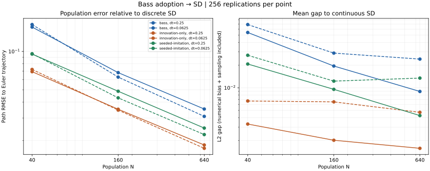
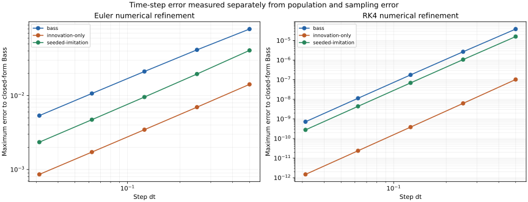

# Bass adoption → SD convergence

The M5 Bass gate now has six population curves: three cases at two time steps,
each with N=40/160/640 and 256 replications. Both the native individual ABM and
independent binomial chain run **4,608 trajectories**. The suite separates
population convergence from the remaining time-step error.

## Model and the two limits

[`abm::models::Bass`](../include/ankurafathom/abm/models/bass.hpp) uses the native
typed synchronous population. Each agent holds an integer adoption flag (0 or 1).
An unadopted agent adopts with probability `dt * (p + q*a)`, where a is the fraction
adopted in the common pre-tick snapshot. All agents read that snapshot; newly
adopted agents influence the next tick. Adoption is irreversible and membership
is fixed. The rates p and q have inverse-time units.

This is the linear-probability synchronous Bass process. Its large-population
limit at a fixed step is the Euler recurrence:

```
a[k+1] = a[k] + dt * (p + q*a[k]) * (1 - a[k])
```

The matching continuous SD equation is `da/dt = (p + q*a)*(1-a)`. For `p+q > 0`
and `p+q*a0 > 0`, its solution is:

```
e = exp(-(p+q)*t)
a(t) = (p + q*a0 - p*(1-a0)*e) / (p + q*a0 + q*(1-a0)*e)
```

Unseeded pure imitation stays at zero; full adoption and zero-rate cases remain
constant. Increasing N removes population noise; decreasing dt removes Euler
bias. The validation measures both limits rather than treating a fixed-dt
trajectory as an exact continuous-time model.

The constructor requires finite nonnegative p/q, finite positive dt and
`dt*(p+q) <= 1` over the whole adoption domain. Invalid probabilities are rejected,
never clipped or replaced by exponential-hazard probabilities. States must be
0/1; population allocation is bounded at one million agents. Stable IDs must fit
the RNG address. Updates 0..65535 use per-agent Philox addresses with a dedicated
stream and draw index zero. Time is integer tick count times dt, and each tick
must advance finitely. A complete population phase and tick commit together.
Scripted uniforms are finite [0,1), one per agent, with strict `u < probability`.
Queries consume no draws; copies retain their own state. Empty populations are
valid and advance their clock.

This native model adds no IR fields and changes no existing adoption IR behavior.
The previous fixed-N `hybrid_bass` test remains a separate regression.

```sh
cmake --build build --target fathom_bass
./build/fathom_bass
```

The example emits nine conserved, irreversible adoption observations through t=8.

## Frozen evidence

The [plan](../tests/oracles/hybrid/bass-mean-field-plan.json) was fixed before either
sample ensemble. Both steps (0.25, 0.0625) use observation times 0, 1, 2, 4, 6 and 8.
There are **27,648 count observations per stochastic engine**. The independent
reference uses pinned NumPy PCG64 and the exact conditional count transition
`new_adopters ~ Binomial(N-A, dt*(p+q*A/N))`. It does not use individual records,
native phases or Philox. Pinned SciPy DOP853 independently checks the closed-form
SD values to 2e-11.

| Case | p | q | Initial adoption | Path RMSE at dt=0.0625, N=40 | N=160 | N=640 |
|---|---:|---:|---:|---:|---:|---:|
| Bass | 0.03 | 0.7 | 0 | 0.155364 | 0.068162 | 0.035300 |
| Innovation only | 0.15 | 0 | 0 | 0.069347 | 0.035170 | 0.018419 |
| Seeded imitation | 0 | 0.7 | 0.1 | 0.095322 | 0.048682 | 0.025015 |

Path RMSE averages squared fraction error to the corresponding Euler trajectory
across replications and five noninitial observation times. Across all six curves,
quadrupling N produces RMSE ratios **0.387–0.524**. Finest/coarsest ratios are
0.190–0.266. The frozen limits are [0.25,0.8] per population increase and at most
0.4 overall.



The right panel reports the ensemble-mean L2 gap to continuous SD, including
numerical bias and sampling variation. For the Bass case at N=640, reducing dt
from 0.25 to 0.0625 reduces that gap from **0.02406 to 0.00894**. The separately
measured Euler bias is 0.02310 and 0.00582 respectively. Sampled mean errors need
not decrease monotonically; for example, seeded imitation at dt=0.25 retains a
visible numerical-error floor.

All declared gates pass:

- **90 independent distribution comparisons**: maximum KS 0.117188 against a
  fixed 0.217413 cutoff, plus mean gaps within `max(0.015, 6*SE)`. The plan records
  family alpha 0.001 and power against a declared population CDF separation of
  0.45. This is not a claim of sensitivity to every smaller discrepancy.
- **30 finest-N mean checks**, within `0.012 + 6*SE` of discrete SD; continuous
  comparisons add the separately measured absolute numerical error to that bound.
- **30 independent analytic checks** on innovation-only mean and variance. At
  time t, `A ~ Binomial(N, 1-(1-p*dt)^(t/dt))`. Variance checks use the binomial
  fourth central moment to estimate the sampling error of the sample variance.
- **72 exact count snapshots** against a separate Python individual Philox
  recurrence, using first/last replication addresses at N=40. Native hand tests
  include 320 high-address tick comparisons and three independently generated
  high-address golden states, snapshot semantics, probability boundaries,
  absorption, empty populations, rollback/retry, copies and address exhaustion.
- **Three numerical-refinement checks**, each covering five Euler/RK4 steps:
  0.5, 0.25, 0.125, 0.0625, 0.03125. Native Euler agrees exactly locally with the
  independent recurrence. Euler fine/coarse error ratios are 0.479–0.524; final
  RK4 coarse/fine ratios are 15.78–16.06. Maximum finest Euler error is 0.005364
  (limit 0.01); maximum finest RK4 error is 7.18e-10 (limit 1e-8).



The [gap CSV](figures/hybrid/bass-mean-field-gaps.csv) separates ensemble-mean gap
to discrete SD, mean gap to continuous SD, numerical bias, within-ensemble spread,
and Monte Carlo standard error. The scorer checks the exact empirical identity
`path MSE = squared mean gap + population variance`. Report intervals are
approximate pointwise sampling diagnostics, not parameter uncertainty or joint
confidence bands. [Refinement values](figures/hybrid/bass-mean-field-refinement.csv)
and [figure provenance](figures/hybrid/bass-mean-field-provenance.json) are also stored.

Coverage, types, tick clocks and monotonic population counts are checked for every
row. Corrupt references are rejected. Frozen ABM and frozen SD negative controls
pass structural checks but fail the scored dynamics gates. Pinned regeneration
reproduces all count rows exactly and gives zero local SciPy difference.

These finite cases/horizons provide empirical evidence for the two limits; they
do not certify every parameter regime or calibrate real-world adoption effects.
See [platform status](STATUS.md) for normal/sanitizer results and
[M5 tracking](M5_ACCEPTANCE.md) for the remaining bridge and fluid-limit work.

**Nine distinct focused tests pass in normal and ASan/UBSan builds**, including
the five new tests, existing Bass check, both population foundations and Philox.
Native generation takes about 285/905 seconds. Normal/sanitizer trajectories and
scored reports agree exactly; both example executables emit the same nine rows.
The new high-address golden and clock-overflow checks were rebuilt and rerun in
both builds. Configured suite: 180 tests; last full-suite checkpoint: 170/170 per
build. This increment changes no shared engine implementation or IR/schema code.

## Reproduction

```sh
cmake --build build --target bass_tests hybrid_bass_oracle_tests
ctest --test-dir build -R '^(bass|hybrid_bass.*)$' --output-on-failure
.venv-abm-oracle/bin/python tests/oracles/hybrid/bass_mean_field_oracle.py --verify --contract
MPLCONFIGDIR=/tmp/ankurafathom-mpl .venv-abm-oracle/bin/python \
  tests/oracles/hybrid/bass_mean_field_oracle.py \
  --report build/hybrid-bass-report.json --plot docs/figures/hybrid
```

Routine CTest scoring uses only the Python standard library and the stored reference.
Regeneration requires `tests/oracles/hybrid/requirements.txt`; figures additionally
use `plot-requirements.txt`. To rescore existing trajectories, select
`'^hybrid_bass_(contract|comparison)$'` with `-FA hybrid_bass_report` so CTest does
not rerun the fixture. CI includes pinned regeneration; remote CI has not run.
