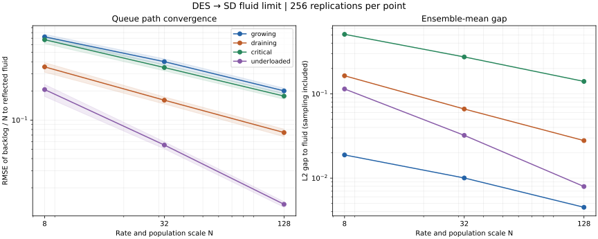
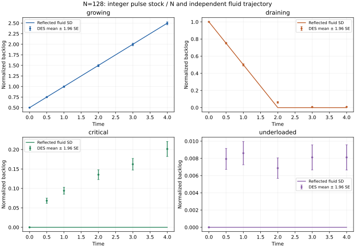

# DES queue → SD fluid limit

The declared M5 fluid model passes four scaling curves and 180 independent
distribution comparisons. Each stochastic engine runs **3,072 trajectories** at
scales N=8,32,128, with 256 replications per point. This checks a real native
source/server/pulse/SD coupling as well as its large-scale approximation.

## Native accounting and event contract

[`hybrid::models::QueueBacklog`](../include/ankurafathom/hybrid/models/queue_backlog.hpp)
composes five existing native components: a scheduled source, FIFO single server,
arrival-to-pulse bridge, completion-to-pulse bridge and clocked SD model. Arrival
pulses add one job; completion pulses remove one job. The stock starts at zero;
initial queued jobs arrive as a time-zero batch and populate the stock through
the same bridge. They are never also assigned as an initial stock value.

The stock uses whole-job units, stored as doubles within an explicit one-million
entity schedule bound. These integers and unit pulses are exactly representable.
Only the statistical comparison divides the stock by N. Every observation drains
all events and bridge publications at or before its horizon, then checks exactly:

```
source emissions = server admissions
backlog stock = arrivals - completions = waiting jobs + busy indicator
```

The backlog **includes the job in service**. A source batch retains its declared
order for simultaneous arrivals; the single server preserves that FIFO order.
When a completion and arrivals coincide, the server completes the active job,
accepts the arrivals, and starts the next waiting job. Bridge publications can
lag the producing event by a zero-time microstep; observations see the fully
drained state rather than that intermediate state.

Every kernel step uses checked transactional execution. A failed step restores
its atomics, pending publications and calendar. Earlier successful steps within
an observation request remain committed: this is **per-step rollback**, not
whole-horizon rollback. A step-budget interruption can therefore leave bridge
publication pending; retrying the same horizon finishes it. Invalid or backward
horizons and zero step budgets are rejected. Queries return values obtained from
the current simulator components, including after rollback replaces component
instances. Empty schedules remain valid.

Hand evidence covers **all 120 component declaration orders**, nine exact
observations per order, source-order ties, arrival/completion confluence, sparse
versus dense observation, retry after a budget stop, and complete event rollback
when a successor service deadline overflows. An off-grid fluid-emptying hand case
checks reflection and same-interval inflow funding of constrained service.

```sh
cmake --build build --target fathom_queue_backlog
./build/fathom_queue_backlog
```

The example produces nine arrival/completion/waiting/busy/stock observations.
This native composition adds no declarative IR fields or general typed bridge
graph support.

## Scaling and independent references

The [frozen plan](../tests/oracles/hybrid/des-fluid-plan.json) uses a FIFO M/M/1
queue: Poisson arrival rate N*lambda, independent exponential service rate N*mu,
and N*b0 initial jobs. It observes t=0,0.5,1,2,3,4. Native arrivals and service
durations use distinct Philox streams addressed by entity ID; schedule generation
continues past the horizon to establish that all arrivals through t=4 were included.
An entity guard throws if exhausted instead of silently truncating the workload.

The continuous fluid approximation for these constant rates is:

```
b(t) = max(0, b0 + (lambda - mu)*t)
```

The native SD comparison has inflow lambda and requested service outflow mu,
with the existing conservative Euler outflow limiter and an explicit service
priority. Available backlog plus interval inflow limits actual service at zero.
Both dt=0.25 and dt=0.125 match the independent closed form exactly locally at
all 48 scored SD observations. The declared numerical tolerance is 2e-12. These
constant-rate, binary-exact fixtures do not establish a general convergence order
for nonlinear or time-varying fluid systems.

The independent stochastic engine uses a direct birth/death Markov chain:
birth rate N*lambda, death rate N*mu only when backlog is positive. It uses Python's
`random.Random`, an independent seed and its own event loop. It shares no native
queue, server, pulse bridge or event calendar. A separate individual-job Lindley
recurrence using independent Python Philox matches **48 addressed count snapshots**
at the smallest scale, including arrivals, departures and pulse stock. Thus count
distributions and addressed schedule replay have separate references.

## Results and statistical scope

| Case | lambda | mu | b0 | Path RMSE, N=8 | N=32 | N=128 |
|---|---:|---:|---:|---:|---:|---:|
| Growing | 1.5 | 1 | 0.5 | 0.723886 | 0.400905 | 0.200266 |
| Draining | 0.5 | 1 | 1 | 0.354226 | 0.160489 | 0.074330 |
| Critical | 1 | 1 | 0 | 0.675526 | 0.348804 | 0.176863 |
| Underloaded | 0.5 | 1 | 0 | 0.206581 | 0.055263 | 0.013498 |

Path RMSE averages squared normalized-backlog error over replications and all five
noninitial observation times. The growing/draining/critical errors have ratios
0.453–0.554 when N quadruples. Underloaded ratios are 0.244–0.268. The acceptance
policy deliberately permits different empty-boundary behavior: consecutive ratios
must lie in [0.15,0.8], finest/coarsest must be at most 0.4, and finest absolute
RMSE at most 0.4. All four curves pass without changing the sampling plan or gates.



**All 180 independent mean/KS gates pass** for normalized backlog, arrivals and
completions. Maximum KS distance is 0.125 against a fixed 0.223553 cutoff; mean
gaps must also fit `max(0.02, 6*SE)`. The plan records family alpha 0.001 and a
conservative miss bound of about 0.00564 for a declared population CDF separation
of 0.45. This does not establish sensitivity to every smaller defect.

The [numeric gaps](figures/hybrid/des-fluid-gaps.csv) separate path RMSE,
ensemble-mean L2 gap, stochastic spread and Monte Carlo standard error. The scorer
checks `path MSE = squared mean gap + population variance`. Shading and error
bars are approximate pointwise 95% sampling diagnostics, not parameter uncertainty
or simultaneous confidence bands. [Figure provenance](figures/hybrid/des-fluid-provenance.json)
records the full report hash and plotting version.



At critical load, the fluid backlog is zero but the finite-N queue has positive
mean backlog. Its mean gap shrinks from 0.50876 to 0.14049 across the tested scales.
Similarly, the draining queue can remain occupied around the fluid emptying time.
These are finite-population effects, not SD numerical error or Monte Carlo noise.
The fluid line need not fall inside confidence bars around a finite-N queue mean.
Increasing replications alone would narrow those bars without removing this gap.

All **18,432 observations per stochastic engine** are checked for exact stock,
queue and count accounting, identity/order coverage, nonnegative integer counts,
valid busy flags and monotonic cumulative arrivals/completions. Corrupt reference
rows are rejected. A disabled-service negative control retains valid bookkeeping
but fails the distribution and all four scaling gates. Frozen fluid dynamics fail
the nonconstant SD checks. Standard-library reference regeneration reproduces all
count rows exactly; the reference metadata hashes the plan and adapter.

Evidence is for this constant-rate, single-server, finite-horizon workload. It does
not certify arbitrary routed networks, priority disciplines, time-varying capacity
or fitted real-world process parameters. See [platform status](STATUS.md) for build
results and [M5 acceptance tracking](M5_ACCEPTANCE.md) for unfinished bridge kinds.

**Ten distinct focused tests pass in normal and ASan/UBSan builds**: five new
checks and five existing SD/server/process/clock/pulse regressions. Native ensemble
generation takes about 204/897 seconds. Normal/sanitizer trajectory bytes and
scored reports agree exactly; both standalone examples produce the same nine
observations. The failed-completion rollback check was rebuilt/rerun in both
builds. The configured suite has 185 tests; the last full-suite checkpoint remains
170/170 per build. No existing engine or IR/schema implementation changed.

## Reproduction

```sh
cmake --build build --target hybrid_fluid_tests hybrid_fluid_oracle_tests
ctest --test-dir build -R '^hybrid_fluid' --output-on-failure
python3 tests/oracles/hybrid/des_fluid_oracle.py --verify --contract
MPLCONFIGDIR=/tmp/ankurafathom-mpl .venv-abm-oracle/bin/python \
  tests/oracles/hybrid/des_fluid_oracle.py \
  --report build/hybrid-fluid-report.json --plot docs/figures/hybrid
```

Scoring and independent regeneration need only Python's standard library.
Figure rendering uses the existing pinned `plot-requirements.txt`. To rescore
saved native trajectories without rerunning them, select
`'^hybrid_fluid_(contract|comparison)$'` with `-FA hybrid_fluid_report`.
CI includes regeneration; remote CI has not run.
