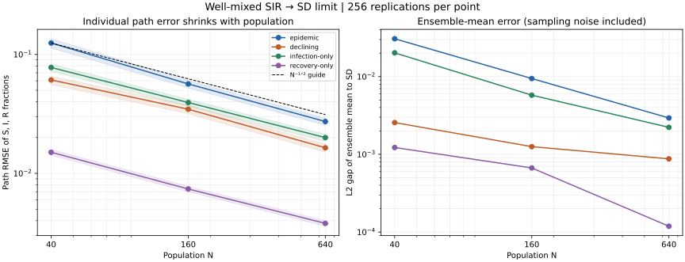
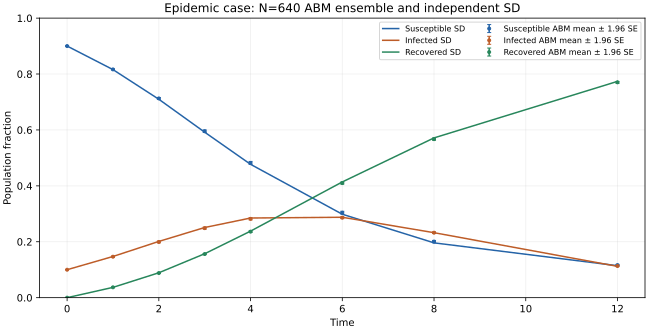

# Well-mixed SIR → SD convergence

The M5 SIR mean-field gate passes for four frozen cases at populations 40, 160 and
640, with 256 replications per point. The native individual ABM and an independent
aggregate stochastic reference each run **3,072 trajectories**. This is a separate
limit from [M4's finite-graph sync/async convergence](ABM_SIR_ASYNC.md).

## Native model contract

[`AsyncSIR::well_mixed`](../include/ankurafathom/abm/models/sir_async.hpp) retains
individual typed records, stable IDs, the native asynchronous calendar and
transactional event/horizon processing. It uses implicit complete mixing, with no
materialized CSR contacts. Each susceptible has hazard `(beta/N)*I`, each infected
has hazard `gamma`, and each recovered has zero hazard. N includes all agents,
including recovered agents; membership stays fixed. The graph constructor still
takes **per-edge beta**; the new factory takes the **mass-action beta**. Explicit
complete contacts therefore use `beta/N` to represent the same process.

Rates are summed and an individual is selected in stable-ID order. A transition
recomputes the hazards and schedules its successor atomically. Observing an earlier
horizon preserves the pending race. Zero hazard is absorbing; empty populations
are valid. Existing finite-rate, address, strictly advancing clock and rollback
rules apply. This model has no ABM time-step discretization error, and introduces
no new IR fields or general changing-hazard statecharts.

The corresponding native SD model uses fraction stocks and flows:

```
ds/dt = -beta*s*i
di/dt =  beta*s*i - gamma*i
dr/dt =  gamma*i
```

Initial fractions are `(0.9, 0.1, 0)`. The independent continuous reference uses
pinned SciPy DOP853 (`rtol=1e-12`, `atol=1e-14`). Native RK4 steps of 1/32 and 1/64
check numerical error separately from population and sampling variation.

## Frozen design and evidence

The [plan](../tests/oracles/hybrid/sir-mean-field-plan.json) was fixed before native
or reference samples. Observations are at times 0, 1, 2, 3, 4, 6, 8 and 12. The
independent count CTMC uses total hazards `beta*S*I/N` and `gamma*I`, Python random
streams and its own event loop; it never calls the native population or calendar.

| Case | beta | gamma | Path RMSE, N=40 | N=160 | N=640 |
|---|---:|---:|---:|---:|---:|
| Epidemic | 0.8 | 0.3 | 0.124740 | 0.056458 | 0.027266 |
| Declining | 0.4 | 0.6 | 0.061002 | 0.034608 | 0.016394 |
| Infection only | 0.6 | 0 | 0.077663 | 0.039398 | 0.019971 |
| Recovery only | 0 | 0.4 | 0.015038 | 0.007389 | 0.003797 |

Path RMSE is the square root of the mean squared fraction error across replications,
all three compartments and seven noninitial observation times. Quadrupling N gives
error ratios **0.453–0.567**, consistent with the expected N^-1/2 scale. These are
finite-horizon empirical results for the declared parameters, not a universal
convergence proof.



The [numeric gaps](figures/hybrid/sir-mean-field-gaps.csv) separately report path
RMSE, ensemble-mean L2 gap, within-ensemble population spread and Monte Carlo
standard error. The scorer verifies the empirical MSE = squared mean gap +
population variance identity. Mean gaps include sampling noise and are not required
to decrease monotonically. The figure's shaded RMSE intervals and trajectory error
bars are approximate pointwise 95% sampling diagnostics, not parameter uncertainty
or simultaneous confidence bands. SD lines connect the scored observation times.



All declared checks pass locally:

- **96 exact complete-graph equivalence cases**, including full event records,
  pending deadlines, high stable IDs/streams, normalization, absorption and rollback.
- **64 exact count snapshots** and event totals against a separate Python individual
  Philox recurrence, using both boundary replication addresses at N=40.
- **168 independent infected/recovered distribution comparisons**: maximum KS
  distance 0.140625, below the frozen 0.222950 cutoff; mean gaps must also fit
  `max(0.015, 6*SE)`. The plan records family alpha 0.001 and a conservative miss
  bound about 0.00545 for a population CDF separation of 0.45. This is power against
  a large declared alternative, not sensitivity to every small discrepancy.
- **84 finest-N mean/SD comparisons**, bounded by `0.012 + 6*SE`, and **four
  population-scaling curves**: each consecutive RMSE ratio in [0.25, 0.8], with
  finest/coarsest at most 0.4.
- **Four RK4 checks**: finest maximum error 9.56e-12, below 1e-8; observed halving
  ratios 11.44–16.82, within [10, 22]. The declining case is already near reference
  numerical precision, so the ratio is less informative there than the absolute gap.
- Exact integer conservation, irreversible states, event accounting, absorbing
  histories, recovery-only analytic decay, reference coverage and corruption checks.
  A frozen-agent negative control preserves accounting but fails the distribution
  and convergence gates.

Reference regeneration reproduces every aggregate CTMC count/event row exactly and
has zero local SciPy difference. Metadata hashes the plan, adapter and pinned
requirements. [Figure provenance](figures/hybrid/sir-mean-field-provenance.json)
records the full native report hash and Matplotlib version. No real-world parameter
calibration or causal claims are involved.

All five new tests and twelve existing focused regressions pass in normal and
ASan/UBSan builds. The native ensemble takes about 269 seconds normally and 822
seconds with sanitizers; output bytes agree exactly. Both existing graph-SIR output
files match their pre-change hashes in both builds. The configured suite has 175
tests; the last full-suite checkpoint remains 170/170 in each build.

## Reproduction

Routine CTest scoring uses Python's standard library and the stored reference:

```sh
cmake --build build --target hybrid_sir_tests hybrid_sir_oracle_tests
ctest --test-dir build -R '^hybrid_sir' --output-on-failure
```

To rescore existing trajectories without rerunning the ensemble, use CTest's
`-FA hybrid_sir_report` with `-R '^hybrid_sir_(contract|comparison)$'`.
Pinned independent regeneration and optional figure rendering:

```sh
.venv-abm-oracle/bin/python -m pip install -r tests/oracles/hybrid/plot-requirements.txt
.venv-abm-oracle/bin/python tests/oracles/hybrid/sir_mean_field_oracle.py --verify --contract
MPLCONFIGDIR=/tmp/ankurafathom-mpl .venv-abm-oracle/bin/python \
  tests/oracles/hybrid/sir_mean_field_oracle.py \
  --report build/hybrid-sir-report.json --plot docs/figures/hybrid
```

The CI workflow includes pinned regeneration; remote CI has not run. M5 remains
open for [the remaining bridge and convergence gates](M5_ACCEPTANCE.md).
